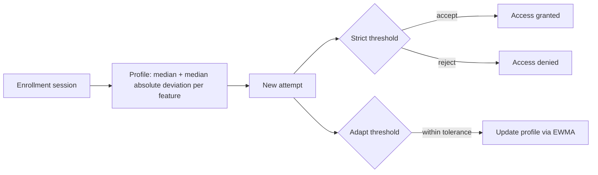
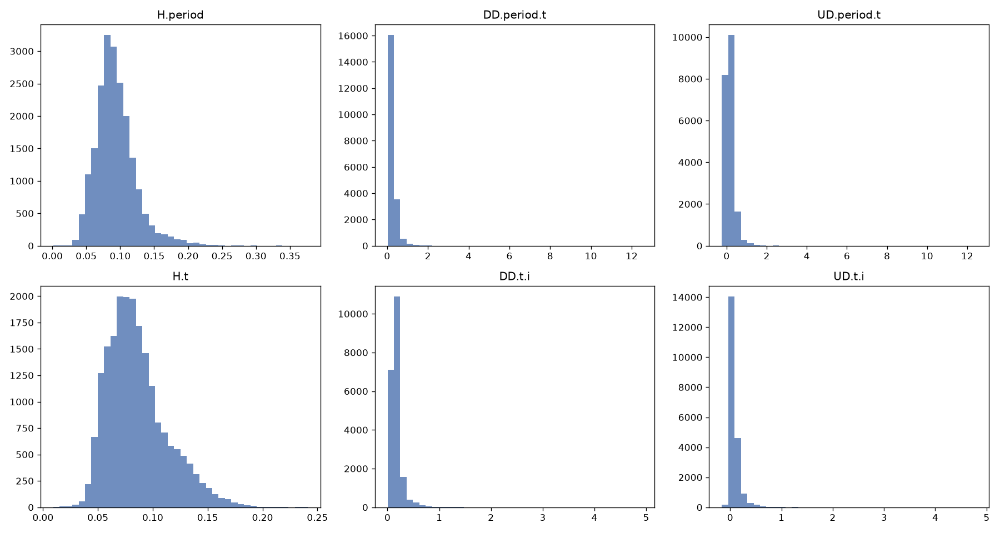
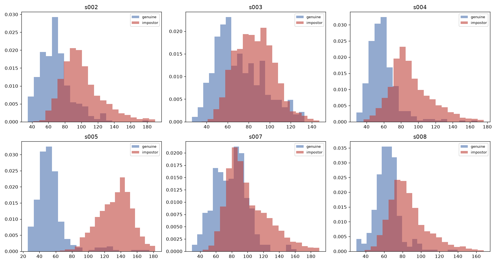

# Feature-Drift-Adaptive Keystroke Verification

## Overview
A keystroke authentication method that adapts to a user's typing changing
over time, without retraining from scratch. Built and validated on CMU's
DSL-StrongPasswordData (2009), then evaluated on a second, unrelated
dataset (KeyRecs, 2023) with no retuning, to check whether it holds up
outside the data it was built on.

## What this name means

**Feature drift**: the timing values that make up a user's typing pattern
change gradually over time, even though the user has not changed. This is
distinct from concept drift, where the definition of the task itself
changes; here, the user's identity and the password stay fixed, only the
timing measurements shift.

**Adaptive**: the biometric profile updates itself to track this drift,
using an exponentially weighted moving average, rather than staying fixed
after enrollment or requiring a full retrain.

**Keystroke verification**: the task is confirming whether a typing
sample belongs to the specific person it claims to belong to, not
identifying which of many possible users produced it.

## Method
Each user's biometric template ("profile") is a median and MAD (median
absolute deviation, a measure of typical spread that is less sensitive to
outliers than standard deviation) computed per timing feature from one
enrollment session. A new attempt is scored by its scaled Manhattan
distance from the profile: the sum, across features, of the absolute
deviation from the profile median, divided by that feature's MAD.

Two thresholds govern the system. A strict threshold, selected by
maximizing balanced accuracy (the average of the true accept and true
reject rates) on held-out enrollment-session data, determines whether an
attempt is granted access. A second, looser threshold, calibrated to a
chosen tolerated false accept rate (FAR), determines whether an attempt
is close enough to be incorporated into the profile via an exponentially
weighted moving average, even when it was not close enough to be
accepted. This two-threshold design lets the profile track legitimate
drift in typing behavior without loosening the criterion used for actual
access decisions.

Enrollment is deliberately restricted to a single session, and every
subsequent session is treated as a candidate for drift. An earlier
version of this method pooled several sessions for enrollment, which
understates the difficulty of the problem a real system would face, since
a live system typically does not get multiple calibration sessions before
its first real decision.

## Datasets
- CMU DSL-StrongPasswordData (2009): 51 subjects, 8 sessions each,
  collected on separate days. [[link](https://www.cs.cmu.edu/~keystroke/)]
- KeyRecs (2023), fixed-text condition: 99 participants, 2 sessions each.
  [[link](https://zenodo.org/records/7886743)]

## Results

| | CMU, fixed profile (baseline) | CMU, adaptive | KeyRecs, adaptive (out-of-sample) |
|---|---|---|---|
| FAR (false accept rate) | 7.6% | 9.3% | 11.7% |
| FRR (false reject rate) | 39.1% | 18.7% | 23.0% |
| EER (equal error rate) | 18.3% | 11.7% | 16.5% |
| Accuracy | 76.7% | 86.0% | 82.6% |

Both CMU columns are measured on the same 36 held-out users. The fixed
profile is the same method with adaptation switched off. Adaptation cut
the false reject rate roughly in half, from 39.1% to 18.7%, at the cost of
a 1.7-point rise in the false accept rate. Whether that trade is
acceptable depends on the deployment: it favors systems where locking out
a legitimate user is more costly than an occasional false accept.

Alpha (the adaptation rate) and target_far were chosen on a separate
validation subset of 15 CMU users and locked before touching the holdout
users. Those same locked values were then reused unchanged on KeyRecs.
The drop from CMU to KeyRecs is expected, since KeyRecs is a different
population and typing task, evaluated with no retuning.

The worst KeyRecs result was a participant rejected on every
second-session attempt. This is a sudden-drift failure: their typing in
the second session was already far enough from their enrollment session
that almost no attempts passed even the looser adapt threshold, so the
profile could not begin following their new pattern.

## Exploratory checks

## Limitations
- Holdout sets are small (36 CMU users, 99 KeyRecs participants), so
  individual metrics carry meaningful sampling variance and the reported
  averages should be read as estimates, not exact figures.
- Each user's enrollment session is split into enroll and held-out data
  with a single random seed. Results from other splits were not measured.
- Both datasets are fixed-text password typing collected in a lab
  setting. Performance on free-text typing or in a real deployment is
  untested.
- CMU spans 8 sessions across separate days and KeyRecs spans 2, so the
  method has been tested against drift accumulated over days, not the
  months or years a real deployment would need to handle.
- The method has no recovery path for cold-start failures: if a user's
  typing has already drifted past the adapt threshold, the profile never
  updates.
- This is a verification task (is this the claimed user), not
  identification (which user, out of many, produced this sample), which
  is the actual target use case and has not yet been built.
- The only baseline is the same method without adaptation. No
  periodically retrained classifier has been compared, so the benefit of
  adaptive updating over simple retraining is not directly measured here.

## Next steps
- Identification: given a typing sample, determine which of many
  enrolled users produced it, rather than verifying a single claimed
  identity.
- A periodically retrained supervised baseline, to quantify what
  adaptive updating gains over simply retraining on a schedule.

## Files
- `cmu.ipynb`: method built and validated on CMU
- `KeyRecs.ipynb`: same method, unchanged, run on KeyRecs
- `cmu_keyrecs_sharedfunctions.py`: profile, scoring, and threshold
  functions shared by both notebooks

## Running this
Install the requirements, download both datasets into this folder, then
run `cmu.ipynb` followed by `KeyRecs.ipynb`.